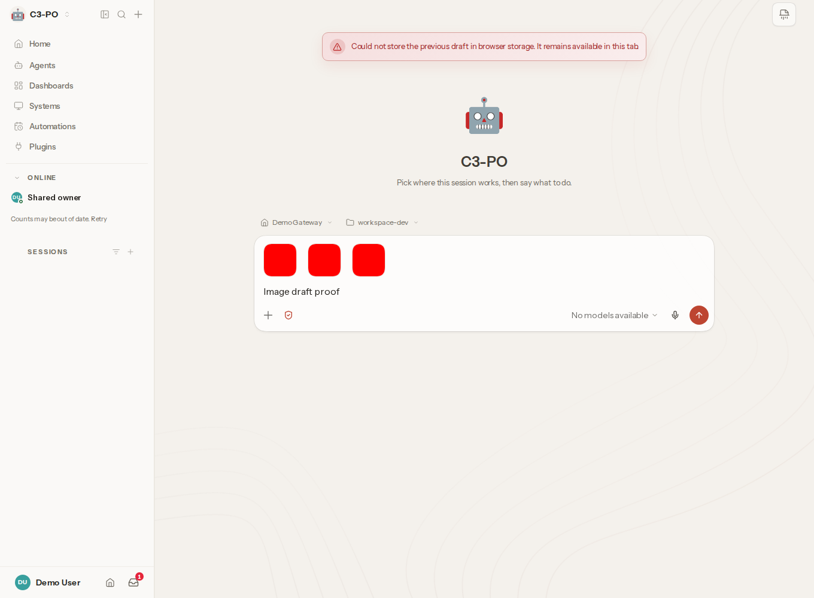
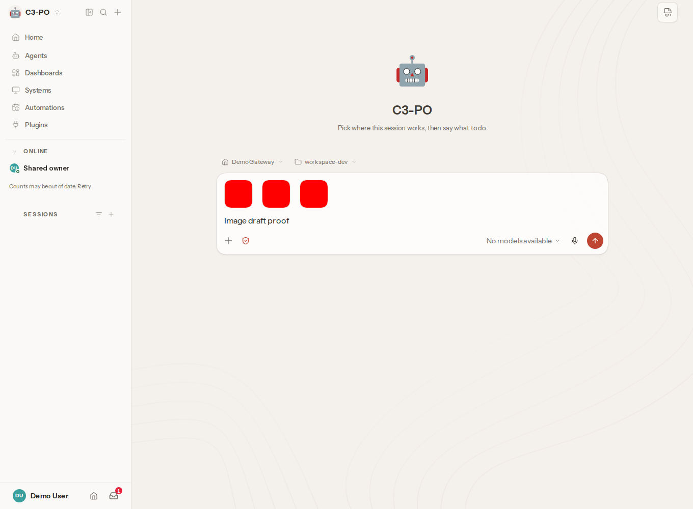
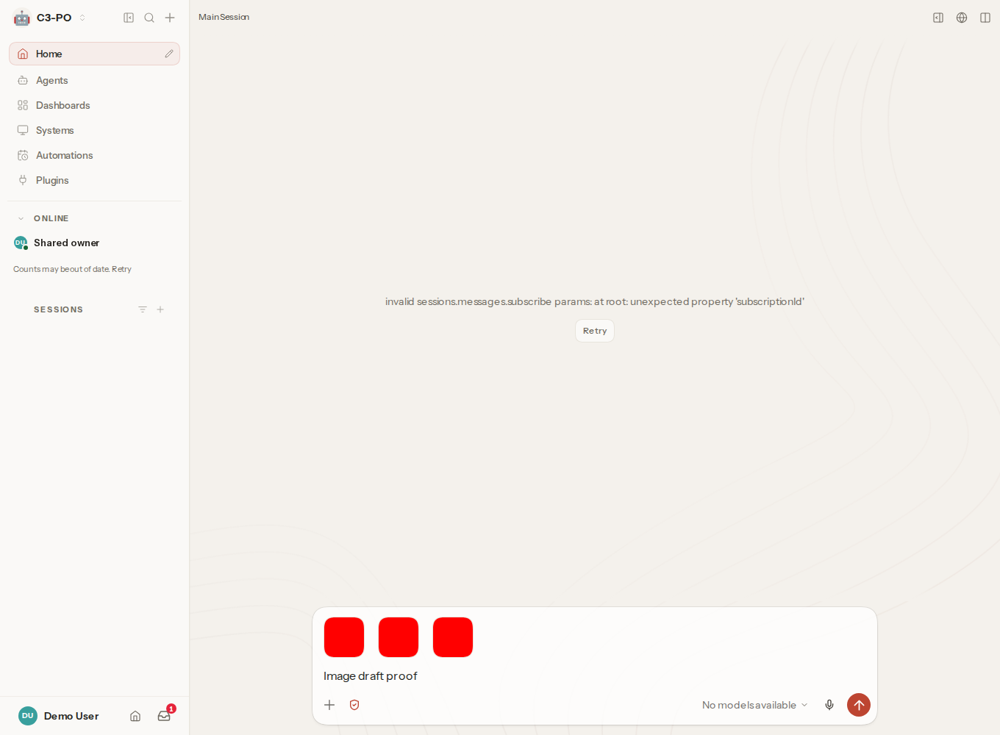

# Image draft source-file lifetime proof

PR: https://github.com/openclaw/openclaw/pull/163964

Baseline daa9ee37ade523ed085b28429ee6bd4dbd46a6bc; candidate 3cb04ea6d88926c7a43d4db6406c4b415bde0da4. Ubuntu 24.04 x86_64, Node 24.19.0, Playwright 1.63.0, Chromium 153.0.8010.12, headless persistent disk profile. Runs October 2, 2026, 9:21-9:35 PM Pacific (2026-10-03T04:21:00Z to 2026-10-03T04:35:00Z).

Real Chat and New Session routes, normal token login to an isolated 2026.9.6 Gateway, Vite source serving. This is NOT a production bundle build: Vite loads the five changed production files directly from the named Git revisions; EXPECTED_SOURCE and SERVED_SOURCE record matching Git blob hashes. The rest of the checkout is baseline. No storage function, failure result, file content, or warning was stubbed. Only gateway display-name discovery returns Demo Gateway; the profile display name is set through Settings.

Three native disk-backed image/png files, each 3145728 bytes: a valid one-pixel red PNG padded with zeros (fixture encoded in the harness). Native file input selection, wait for all three ready thumbnails, unlink files, then type Image draft proof. Browser-native IndexedDB transaction listeners record put/commit/abort without changing native return values. Numbers are performance.now() milliseconds since document navigation. Fresh persistent browser directory each case. No message sent; no model call.

| Route | Before | After |
| --- | --- | --- |
| New Session | deletion 2836.1; put 3 at 3090; DataError Failed to write blobs (IOError); actual warning | deletion 4034.3; put 3 at 4273.7; commit; no storage warning |
| Chat | put 1 at 3505.9; deletion 3532.2; transaction abort DataError; put 3 at 3598.5; actual warning | deletion 4441.5; put 3 at 4537.4; commit:3; no storage warning |

Each PNG was visually inspected before publication. Read the accompanying raw logs, not the screenshot alone, for the native outcome. Chat can schedule intermediate one/two-image saves while reads complete. The final after run explicitly waits for commit:3, not an earlier transaction. New Session logs predate that label refinement and contain exactly one put:3 followed by commit.

## Reproduction detail that changes the result

Use chromium.launchPersistentContext(aFreshDirectory, options). An earlier identical New Session baseline using chromium.launch() followed by browser.newPage() (off-the-record storage) committed after deletion instead of failing. Changing the context mode reproduced the native disk-blob abort. This is a browser storage-backend distinction, not proof that every Chromium version/platform behaves identically.

## Running

Install the project dependencies and Playwright Chromium. Run from the baseline checkout with the candidate commit available. Point PROOF_GATEWAY_BIN to an isolated 2026.9.6 executable and PROOF_STATE to a scratch state directory. Never point it at a live gateway. Run cases serially because ports 19143 and 19144 are shared:

```sh
PROOF_VARIANT=before PROOF_ROUTE=chat PROOF_KIND=delete timeout 180 node route-capture.mjs
PROOF_VARIANT=after PROOF_ROUTE=chat PROOF_KIND=delete timeout 180 node route-capture.mjs
PROOF_VARIANT=before PROOF_ROUTE=new PROOF_KIND=delete timeout 180 node route-capture.mjs
PROOF_VARIANT=after PROOF_ROUTE=new PROOF_KIND=delete timeout 180 node route-capture.mjs
```

The published harness differs from the executed one only in portable path parameters and the documented final commit-count observer. Earlier baseline/New Session logs used commit rather than commit:N. The PNG fixture is generated in the script, not a private source image.

## Limits

The Chat center shows a real sessions.messages.subscribe protocol mismatch (subscriptionId unsupported by the older Gateway), unchanged on both sides. This does not prevent the real composer or browser-local IndexedDB writes. No Chat history/subscription success is claimed. No reload check is claimed by this harness. A separate contributor provided built-bundle/reload evidence in the PR. The exact original user incident remains unknown.

Fresh uploads cannot exercise the 25 MiB draft warning with the default hello policy: (25 MiB - 256 KiB) * 3/4 = 18.5625 MiB total attachment admission. The five-by-5.5 MiB attempt admitted only three. We did not raise limits or bypass this guard. resolveChatAttachmentLimits returns undefined for absent attachment policy and Infinity for absent maxPayload; persistence and recovered payloads have their independent cap, so the classification remains meaningful outside default picker admission. This is source reachability, not a demonstrated nondefault deployment. Existing contributor-provided size-warning images explicitly disclose a composer-state fixture that bypasses picker admission; they must not be described as normal fresh uploads.





